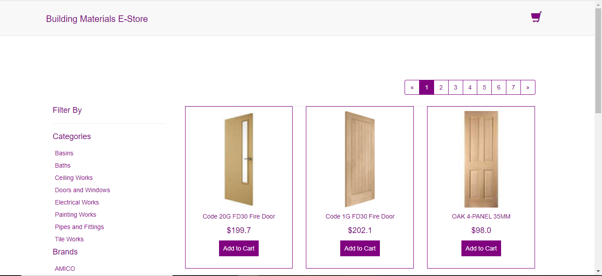
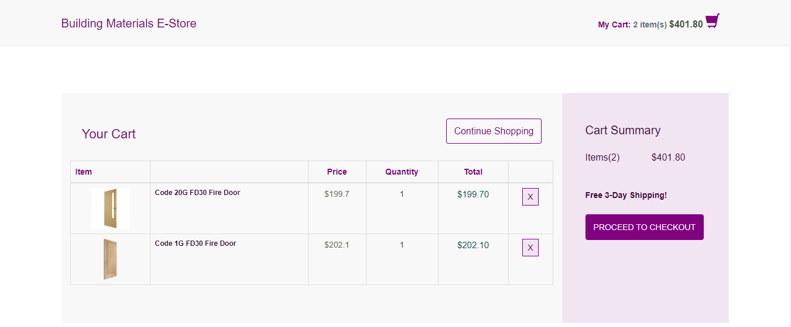
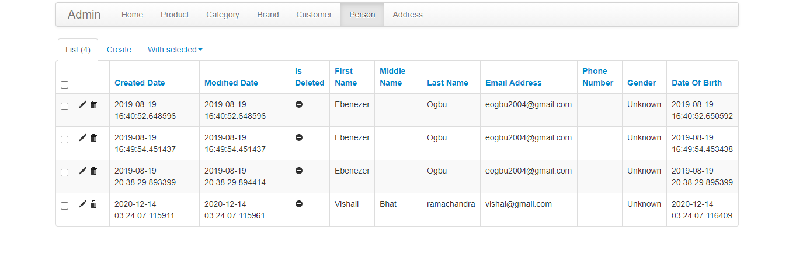

# building-materials-E-store
Built a building material e-store by leveraging python basic building blocks and Flask framework.

Link to live application-https://building-materials-e-store.herokuapp.com/catalogue

1)screenshot-1: Catalogue

2)sceenshot-2: Checkout

3)screenshot-3: Admin

